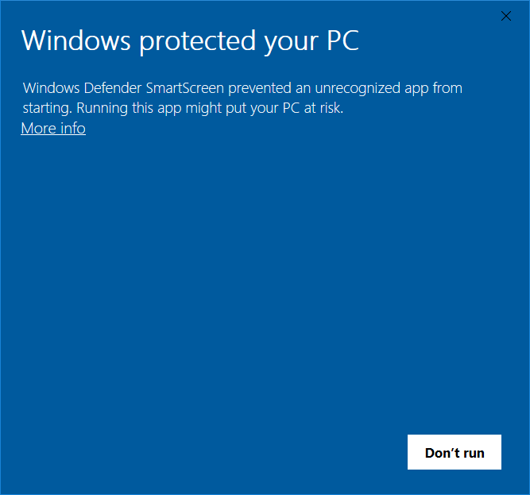

# diffTool

**diffTool** is a GUI application built in [Go](https://golang.org). It finds the diff status of each keyed line between two Excel files by key and then writes the differences to a specificed file.  

## Installation

### Download diffTool.exe  

current release: [diffTool v0.5.0](https://github.com/burch-cm/difftool/releases/download/v0.5.0/diffTool.exe)

On a windows machine, simply download the diffTool.exe from the "current release" link above and place it in any folder to which you have write access. On machines with administrative security policies, you may get a warning that Windows Defender has prevented an unrecognized app from running, which will prevent diffTool from working. Click "more info" and then "run anyway" in order to run the .exe file.  
{:height="50%" width="50%"}  

### Open the directory and run the file  
Open the directory where you downloaded or build diffTool.exe. Either run diffTool.exe from the commmand line or double click on the program name from the file explorer.  
{:height="50%" width="50%"}

The tool will open a system window which will allow you to select two imput files, a key by which to match them, and an ouput file to write the resulting differences.  
{:height="50%" width="50%"}

### Select the imput files to compare  
Clicking on the "Select File" button will open a standard file dialog. Choose the files you want to compare.  
{:height="50%" width="50%"}

Once the files are selected, the filenames will appear next to the select buttons.

After the files are chosen, the column name menu will automatically populate. Select the column to use as a key in comparing the files. The default option may be the best one. In that case, you don't need to select it again.

### Choose where to save the results  
Click on the "Select Ouput File" button and enter a failename of where to save the results of the comparison. The results will be in .xlsx format, so your output file should end in ".xlsx", which you may have to type manually.  
{:height="50%" width="50%"}

### Run the comparison
Click on the "Start Comparison" button to begin the process. Depending on the file size, this may take a few minutes. When the process is complete, a new window will pop up to let you know the process was successful.
{:height="50%" width="50%"}  

## Results

This will produce an Excel .xlsx file with two columns - key and status. Key is the key value of the keyed column used for the set analysis between files, and status takes one of four values: new, removed, changed, same

## How it works  
Under the hood, diffTool reads each file into a Go map using the selected key column and a hash of the line containing that key. Each set of keys is compared for differences and intersections, and the intersectional keys have their line hash values compared to check for differences. The results are paired back to the keys in a key: value map, and then written to a specified file.

## Non-windows systems  
The current release is compiled for Windows 10, but can be recompiled for any go-capable OS. Just clone the repo and run ```go built difftool.go``` to compile on your system.